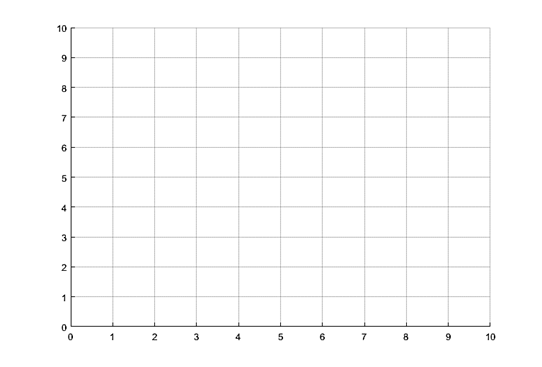
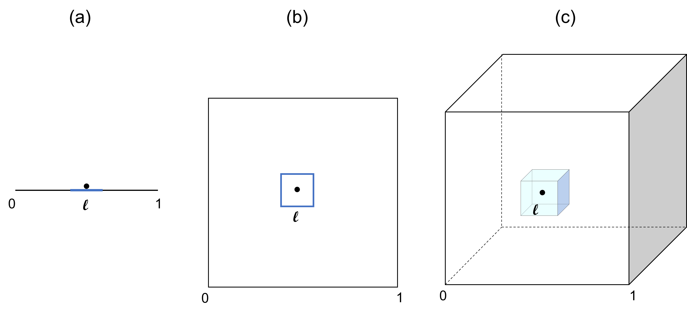

# Bias/Variance - KNN - Problem Set
## CSC4601/5601 Theory of Machine Learning

# Problem 1: Practice KNN by hand
_Note: This problem needs to be done on paper._

Given the following feature matrix, complete the next steps for the KNN algorithm.

| Observation | Feature 1 | Feature 2 | Feature 3 | Class |
| :-: | :-: | :-: | :-: |  :-: |
| 1 | 4 | 7 | 4 | Group 1 |
| 2 | 2 | 8 | 2 | Group 2 |
| 3 | 2 | 6 | 2 | Group 1 |
| 4 | 6 | 4 | 7 | Group 1 |
| 5 | 4 | 6 | 8 | Group 1 |
| 6 | 8 | 1 | 7 | Group 2 |
| 7 | 8 | 5 | 10 | Group 2 |

1. Make a scatter plot of the data using the first 2 features. Use 'x' for "Group 1" points, and "o" for group 2 points.



2. Note: KNN can be used to predict the label of a feature vector or to fill in the missing entries of a column in the feature matrix. In this question, use regression KNN to predict the missing entries of feature 3 for the following 3 data samples. To predict the class of each data sample, rely only on the first 2 features and use classification KNN (you would normally need to rely on the three features to predict the class label, but for brevity use only the first 2 features).

    a. Using KNN with k = 3, fill in the missing values in the table.
    | Observation | Feature 1 | Feature 2 | Feature 3 | Class |
    | :-: | :-: | :-: | :-: |  :-: |
    | 1 | 9 | 2 |  |  |

    \
    \
    b. Using KNN with a k = 2, fill in the missing values in the table.
    | Observation | Feature 1 | Feature 2 | Feature 3 | Class |
    | :-: | :-: | :-: | :-: |  :-: |
    | 1 | 3 | 6 |  |  |

    \
    \
    c. Using KNN with a k = 7, fill in the missing values in the table.
    | Observation | Feature 1 | Feature 2 | Feature 3 | Class |
    | :-: | :-: | :-: | :-: |  :-: |
    | 1 | 9 | 9 |  |  |


# Problem 2: The bias-variance tradeoff

A model's error can be decomposed into variance, bias, and irreducible error:

* __Bias__ refers to the error that is introduced due to wrong assumptions such as approximating a complicated pattern in data with a simple model. A __high-bias__ model is a model that fails to capture the structure in data and results in __underfitting__ the training data. High bias or underfitting is usually caused by a model that is too simple or when there are few features.

* __Variance__ refers to the amount by which the model would change if we used a different training data set. A __high-variance__ model is a model that does not generalize well to new data but performs well on training data, which is also known as __overfitting__. High variance or overfitting is usually caused by a model that is too complex for the data.

* __Irreducible__ error refers to the noise that exists in the data itself.

In general, there is a tradeoff between bias and variance. As the model's complexity increases (for example going from a simple linear model to a polynomial model with a higher degree), its bias will typically decrease but its variance will increase. As the model's complexity decreases, its variance will decrease but its bias will increase.

When a model does not perform well on the training set, we know that the model underfits the training set. When a model performs very well on the training set, but fails to show similar performance on the test set, we conclude that the model overfits the training set (hence the importance of splitting the data into training and test sets).

In this exercise, you will visualize the bias-variance tradeoff of a KNN model. The complexity of a KNN model can be varied by changing the value of the hyperparameter - k - the number of nearest neighbors.

1. How do you expect the complexity of a KNN classifier to change if k increases? In other words, as we increase k, will the decision boundary become simpler and smoother or will it have more angles and curves?

2. Load diabetes.csv and extract the feature matrix $X$ and the label vector $\vec{y}$. The data consists of diagnostic measurements for some female patients and shows whether they have diabetes or not, as indicated by the last column labeled as Outcome.
3. Use the scikit-learn implementation of KNN to instantiate a KNN classifier. For now, keep the default value for the number of neighbors.
4. You will now evaluate the model using cross validation. Use the method [```cross_validate```](https://scikit-learn.org/stable/modules/generated/sklearn.model_selection.cross_validate.html) provided by scikit-learn to evaluate KNN. This method splits the data into 5 folds and returns the training scores and testing scores for each fold. Make sure to set the argument ```return_train_score``` to ```True```. Find the average of the 5 training scores and the average of the 5 testing scores.
5. ```KNeighborsClassifier``` uses k=5 (number of neighbors) by default. Repeat what you did in the previous part by varying k from 1 to 50. For each value of k, find the average accuracy score and the average testing score. On the same figure, plot 2 lines: one showing how the training accuracy changes with k and another line showing how the testing accuracy changes with k.
6. Can you spot where the model has high variance (overfitting) and where it has low variance?

# Problem 3: The curse of dimensionality
_This exercise was adapted from the book "Introduction to Statistical Learning" (exercise 4 in chapter 4)_

KNN tends to perform poorly as the number of features increases. This is due to a phenomenon known as the curse of dimensionality, which we will explore in this exercise.



1. Suppose we have a set of observations that consist of one feature; those observations uniformly cover the interval from 0 to 1 (the black line shown in (a)). Suppose that we wish to predict the response for a new observation (the black dot shown in (a)); this new observation is centered in a sub-interval of length $l$ observations. To make the prediction for this new data point, we want to only use the observations that lie in this sub-interval (the blue line shown in (a)). On average, what fraction of the available observations will we use to make this prediction?
2. Suppose we have a set of observations that consist of 2 features; the observations that uniformly cover the unit square (the black square shown in (b)). Suppose that we wish to predict the response for a new observation (the black dot shown in (b)); this new observation is centered in a smaller square with $l$ as the side length. To make the prediction for this new data point, we want to only use the observations that lie in this small square (the blue square shown in (b)). On average, what fraction of the available observations will we use to make this prediction?
3. Repeat the same question for when the data has 3 features (as shown in (c)). Can you generalize your answer for any number of features $p$?
4. Using the general form from subpart 3 and assuming that $l=0.1$ (representing the fraction of needed observations), how does the fraction of the available observations used in prediction change with $p$? Show a plot (made from coding the relationship) to demonstrate your answer. Can you argue that a disadvantage of KNN is that when $p$ is large, there are few observations that are close to the new data point? _Optional_ - you can think about the fraction of observations as $k/N$, where $k$ is the number of nearest neighbors and $N$ is the number of observations. How many observations ($N$ expressed in terms of $p$) do we need for $k=10$ and $l=0.1$?
5. Assume that you need 10% of the available observations inside the hypercube. (Note: a hypercube is a generalization of a cube; when $p=1$ it is a line, when $p=2$ it is a square, when $p=3$ it is a cube). What is the length of each side of the hypercube? How does the length change as $p$ increases? Again show a plot to explain your answer. Can you argue that when $p$ is large, what KNN assumes as a near neighbor to a data point, might not actually be similar to this data point?
