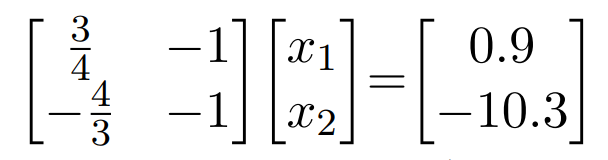
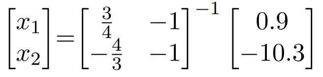

# CSC4601/5601 Problem Set: Logistic Regression

You may complete the following entirely in a Jupyter notebook. Ensure that the notebook has your name on it. In addition to pusing your solution to this repository, you must also upload a copy of the PDF (or HTML) solution to Canvas.

## Problem 1: Observation Distances

Explore how distance from the decision boundary is related to the output of our linear models.

1. Load in the IRIS dataset and put the first two features into a feature matrix. Plot these observations.

2. Plot the following decision boundary on the figure: $$x_2=0.75x_1-0.9$$

3. Find the projections from each observation to the line and plot a line segment for each observation.
   1. We are finding the orthogonal projection of a point (observation) to the line (model)
   2. Note that we are looking for line segments that are orthogonal to the model
   3. $m_{model}m_{orthogonal}=-1\rightarrow m_{orthogonal}=-\frac{4}{3}$
   4. This gives us a 'line template' of $x_2=-\frac{4} {3}x_1+b$, and now we have to solve for b given our point (observation)
   5. Given the first point in the dataset - $Obs_{1}=(5.1,3.5)$, we can solve $3.5=-\frac{4}{3}(5.1)+b\rightarrow b=10.3$
   6. Now we have two equations and two unknowns:
      1. $x_2=\frac{3}{4}x_1-0.9$
      2. $x_2=-\frac{4}{3}x_1+10.3$
   7. We can put these in a standard form:
      1. $\frac{3}{4}x_2-x_1=0.9$
      2. $-\frac{4}{3}x_2-x_1=-10.3$
   8. In the standard form we can use linear algebra to solve for the system of equations:
      - 
      - 
      - Where $(x_1,x_2)$ is the projection of our point (observation) onto the line (model)

   9. You now have two points, solve for the distance between the two points
       - $\lvert\lvert$ a-b $\lvert\lvert$ $\rightarrow0.46$

   10. Add a vector to your figure that connects the point on the model to the observation in space, color it according to the distance.
   11. Do this for all observations in the dataset.

## Problem 2: ROC Curves from Scratch

In this problem, we are going to walk you through creating a Receiver Operating Characteristic (ROC) curve from scratch. Most classifiers can output a continuous-valued ``score,'' not just a categorical class label. The score represents the confidence of the classifier in its decision. Some classifiers such as Logistic Regression and Naïve Bayes are able to predict not just a score but the probability $P(y = 1 | \vec{x})$ that a sample with feature vector $\vec{x}$ belongs to class $1$. An ROC curve allows us to see how different thresholds for the score produce different trade-offs between true and false positive rates. The true positive rate indicates what fraction of the positive predictions are correct, while the false positive rate indicates what fraction of the negatives are mis-predicted as positives.

1. Load the data in the provided file [results.csv](Data\results.csv). The first column contains the estimated probabilities (generated from a machine learning model) that the observation belongs to class 1, while the second column contains the true labels (either 0 or 1).
2. Use 3 thresholds (0.25, 0.5, and 0.75) for the scores to get binary predicted labels. If the score for an observation is less than the threshold, its predicted label should be 0. Otherwise, the predicted label should be 1.
3. For each threshold, create a [confusion matrix](https://scikit-learn.org/stable/modules/generated/sklearn.metrics.confusion_matrix.html).
4. For each confusion matrix, calculate the true and false positive rates. What do you notice about the two rates as the threshold is changed?  Which thresholds give the highest and lowest true positive rates?  Which thresholds give the highest and lowest false positive rates?
5. Create a list of all unique scores. Sort the scores from highest to lowest. Use each score as a threshold and predict the true and false positive rates:
    1. Use the threshold to predict the labels for each observation.
    2. Calculate the true and false positive rates.
6. Plot the true (horizontal) and false (vertical) positive rates for each threshold.
